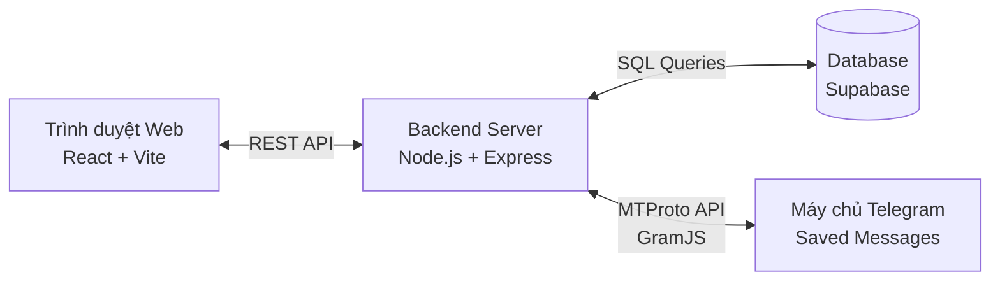

<div align="center">
  
  <h1>🚀 Telegram Drive</h1>
  <p><strong>Hệ Thống Lưu Trữ Đám Mây Cá Nhân Không Giới Hạn Dựa Trên Telegram</strong></p>

  <p>
    <a href="https://telegram-drive-orcin.vercel.app/"><strong>Khám phá Ứng dụng Trực tiếp »</strong></a>
  </p>

  <p>
    
    
    
    
    
  </p>
</div>

---

## 📝 Giới Thiệu (About)

**Telegram Drive** là một giải pháp lưu trữ đám mây cá nhân (Personal Cloud Storage) mã nguồn mở. Ứng dụng tận dụng API của Telegram thông qua giao thức MTProto để biến tài khoản Telegram của bạn thành một kho lưu trữ dữ liệu cá nhân không giới hạn dung lượng và hoàn toàn miễn phí. 

Thay vì phải trả phí hàng tháng cho Google Drive, Dropbox hay OneDrive, bạn có thể lưu trữ tệp tin trực tiếp trong mục **Saved Messages (Tin nhắn đã lưu)** của tài khoản Telegram, quản lý chúng thông qua một giao diện web trực quan, hiện đại và bảo mật.

---

## ✨ Tính Năng Nổi Bật (Key Features)

### 🔒 Bảo Mật & Xác Thực (Security & Auth)
- **Đăng nhập không cần mật khẩu (Passwordless):** Đăng nhập an toàn qua số điện thoại và mã OTP gửi từ Telegram, hoặc quét **Mã QR**. Không cần tạo tài khoản hay nhớ mật khẩu.
- **Xác thực 2 lớp (2FA):** Hỗ trợ đầy đủ bảo mật 2 lớp của Telegram.
- **Mã hóa dữ liệu On-the-fly:** Dữ liệu được mã hóa dạng buffer nhị phân trước khi lưu trữ, đảm bảo quyền riêng tư.
- **Không lưu trữ thông tin nhạy cảm:** Phiên đăng nhập (Session) được mã hóa an toàn (`StringSession`) và lưu trên máy chủ cá nhân của bạn. Không một bên thứ 3 nào có thể truy cập được dữ liệu của bạn.

### 📁 Quản Lý Tệp Tin (File Management)
- **Dung lượng lưu trữ KHÔNG GIỚI HẠN:** Tận dụng hạ tầng đám mây khổng lồ của Telegram.
- **Giao diện hiện đại & Mượt mà:** Tự động chuyển đổi chế độ **Sáng/Tối (Light/Dark Mode)** theo hệ thống, thiết kế tối giản, hỗ trợ xem dạng Lưới (Grid) hoặc Danh sách (List).
- **Tải lên & Tải xuống nhanh chóng:** Tải lên hàng loạt nhiều tệp tin cùng lúc với thanh tiến trình trực quan (Progress Bar).
- **Đồng bộ hóa metadata siêu tốc:** Sử dụng **Supabase** để lưu trữ siêu dữ liệu (metadata) của tệp tin, giúp việc tìm kiếm, phân loại và truy xuất danh sách diễn ra tức thì mà không cần quét lại toàn bộ tin nhắn Telegram.

---

## 🏗️ Kiến Trúc Hệ Thống (Architecture)

Dự án được xây dựng theo mô hình **Monorepo**, bao gồm 3 thành phần chính tương tác chặt chẽ với nhau:



1. **Frontend (`/frontend`)**: 
   - Xây dựng bằng **React**, đóng gói bằng **Vite**, tạo kiểu với **Tailwind CSS v4**.
   - Triển khai trên **Vercel** với cấu hình Reverse Proxy (`/api/*`) để giao tiếp với Backend không lo lỗi CORS.
2. **Backend (`/backend`)**:
   - Sử dụng **Node.js** và **Express**.
   - Cốt lõi sử dụng thư viện **GramJS** để kết nối trực tiếp với Telegram qua giao thức MTProto, xử lý luồng upload/download file trực tiếp.
   - Triển khai qua Docker trên **Render.com**.
3. **Database**:
   - Sử dụng PostgreSQL được quản lý bởi **Supabase**.
   - Lưu trữ `metadata` của file (Tên, dung lượng, định dạng, `message_id`) và mã hóa phiên làm việc của người dùng.

---

## 🚀 Triển Khai Thực Tế (Live Demo)

Dự án hiện đã được triển khai hoàn chỉnh và có thể truy cập tại:
- **Frontend App:** [https://telegram-drive-mt.vercel.app/](https://telegram-drive-mt.vercel.app/)
- **Backend API:** [https://telegram-drive-backend-40xz.onrender.com](https://telegram-drive-backend-40xz.onrender.com)
- **Database:** Supabase Cloud

---

## 🛠️ Hướng Dẫn Cài Đặt (Local Development)

### Yêu cầu hệ thống (Prerequisites)
- [Node.js](https://nodejs.org/en/) (phiên bản 18+).
- Một tài khoản Telegram.
- API ID & API Hash từ [my.telegram.org](https://my.telegram.org/).
- Một project trên [Supabase](https://supabase.com/).

### Các bước cài đặt

**1. Clone Repository**
```bash
git clone https://github.com/mtzwyu/telegram_drive.git
cd telegram_drive
```

**2. Cài đặt các thư viện cần thiết**
```bash
npm install
cd frontend && npm install
cd ../backend && npm install
```

**3. Cấu hình biến môi trường**
Sao chép file `.env.example` thành `.env` (ở thư mục gốc) và điền các thông tin:
- `TELEGRAM_API_ID`, `TELEGRAM_API_HASH`, `TELEGRAM_BOT_TOKEN`
- `SUPABASE_URL`, `SUPABASE_SERVICE_ROLE_KEY`
- `JWT_SECRET`, `ENCRYPTION_KEY`
- `PORT=3000`

**4. Chạy dự án ở chế độ phát triển (Development Mode)**
Mở 2 terminal để chạy song song Frontend và Backend:

Terminal 1 (Backend):
```bash
cd backend
npm run dev
```

Terminal 2 (Frontend):
```bash
cd frontend
npm run dev
```
Truy cập `http://localhost:5173` để trải nghiệm.

> **Ghi chú Triển khai (Deployment):** Để xem hướng dẫn từng bước chi tiết cách deploy lên Vercel, Render và cấu hình Supabase, vui lòng xem tài liệu 👉 **[Hướng Dẫn Triển Khai (walkthrough.md)](./walkthrough.md)** (nếu chạy local).

---

## 🗺️ Hướng Phát Triển Tương Lai (Roadmap)

Chúng tôi luôn muốn cải tiến ứng dụng để ngày một hoàn thiện hơn. Dưới đây là các tính năng dự kiến sẽ có trong tương lai:

- [ ] **Mã hóa đầu cuối (E2EE) phía Client:** Mã hóa tệp tin bằng AES-GCM ngay trên trình duyệt trước khi gửi đi, đảm bảo Zero-Knowledge.
- [ ] **Trình Phát Đa Phương Tiện (Media Streamer):** Phát trực tiếp Video/Audio từ Telegram mà không cần tải toàn bộ tệp về máy (Chunk Streaming).
- [ ] **Quản lý thư mục ảo (Virtual Folders):** Cho phép tạo thư mục lồng nhau, kéo thả (Drag & Drop) tệp tin giữa các thư mục và gắn thẻ (Tags).
- [ ] **Ứng dụng Desktop Auto-Sync:** Ứng dụng chạy ngầm trên Windows/macOS đồng bộ hóa dữ liệu tự động tương tự Google Drive Desktop.
- [ ] **Chia sẻ tệp tin công khai (Public Sharing):** Tạo liên kết chia sẻ tệp tin có thời hạn cho người khác tải xuống.

---

## 🤝 Đóng Góp (Contributing)

Dự án này là mã nguồn mở và mọi đóng góp đều được chào đón! 
Nếu bạn có ý tưởng mới, sửa lỗi, hay muốn tối ưu hóa mã nguồn, xin vui lòng:
1. Fork dự án.
2. Tạo nhánh tính năng mới (`git checkout -b feature/AmazingFeature`).
3. Commit các thay đổi (`git commit -m 'Add some AmazingFeature'`).
4. Push lên nhánh (`git push origin feature/AmazingFeature`).
5. Mở một **Pull Request**.

---

## 📄 Giấy phép (License)

Dự án được phân phối dưới giấy phép **MIT License**. Xem file `LICENSE` để biết thêm chi tiết.

---
<div align="center">
  <b>Được phát triển với ❤️ bởi <a href="https://github.com/mtzwyu">mtzwyu</a></b>
</div>
